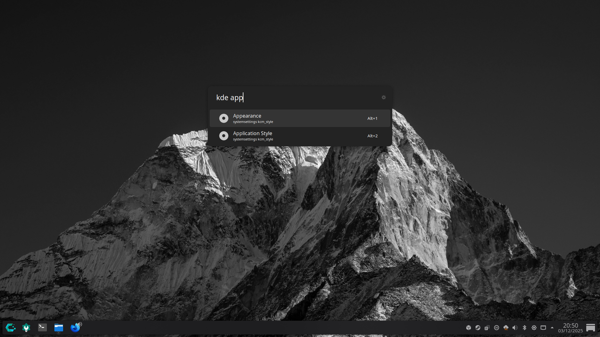

# KDE Settings Launcher — Ulauncher Extension

[](ulauncher://install-extension/github.com/gabrielgv13/kde-settings)

A simple and fast Ulauncher extension that allows you to search and open **KDE Plasma settings modules** directly from Ulauncher.



---

## ✨ Features

- Search KDE settings instantly (`kde appearance`, `kde display`, `kde mouse`, …)
- Opens the exact Plasma System Settings module
- Designed for KDE Plasma 6 (but works on any system with `systemsettings` and the listed KCMs)
- Clean list output (no “Open …” prefixes)
- Fully offline, fast, minimal

---

## 🔧 Installation

1. Open **Ulauncher → Preferences → Extensions**
2. Click **Add Extension**
3. Paste this URL:

```text
https://github.com/gabrielgv13/kde-settings
```

Ulauncher will clone the repo and enable the extension.

---

## 🖥 Usage Examples

In Ulauncher, type:

```text
kde appearance
kde application style
kde display
kde mouse
kde keyboard
kde global theme
kde notifications
```

The extension will show matching KDE configuration modules.

---

## 🧩 Notes

- This extension uses `systemsettings <module>` with the KCMs available on KDE Plasma 6.
- If some modules don't exist on your system, they simply won't be opened when chosen.

---

## 📦 Repository structure

```text
kde-settings/
 ├─ main.py
 ├─ manifest.json
 ├─ icon.png
 ├─ LICENSE
 └─ README.md
```

---

## 📝 License

MIT License — see [LICENSE](LICENSE).
